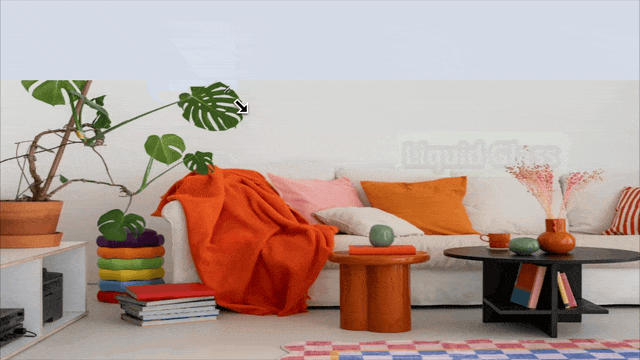
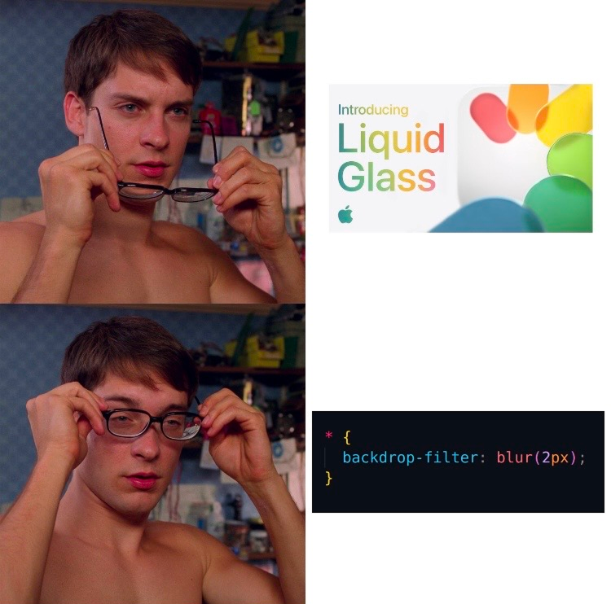

# 🧊 Svelte Liquid Glassifier


Bring Apple's **Liquid Glass UI** (iOS 26) to the web

🔗 [Live Playground](https://glass.danilofiumi.com/)
🎥 [Demo](https://www.youtube.com/watch?v=9QnE37E6jU0)


> Built with **Svelte** and exportable as a **Web Component**, so it works anywhere: React, Vue, Angular, plain HTML — no build tool required.

---

### ✨ What Makes It Different?


**Glassmorphism ≠ Liquid Glass.**
Glassmorphism fakes depth with blur and opacity.  
**Liquid Glassifier** gives you **real responsive fluidity**, motion, and depth.


---

### ✅ Features

- 🔥 Powered by **Svelte** – fast, reactive, lightweight
- 🌐 **Web Component** – plug & play in any frontend stack
- 🌊 True liquid distortion and dynamic lighting
- 🎨 Light & dark mode support
- 🧠 Handles complex layering without breaking


---

### ⚡ Use Anywhere with 1 Script

No build tools. No dependencies. Just copy & paste:

> Liquid Glassifier - Demo preview

#### 1. Load the Web Component:
Paste this in your `<head>`:

```html
<script type="module" crossorigin src="https://glass.danilofiumi.com/web-comps/boundle.js"></script>
```

#### 2. Use the component:
Insert this anywhere in your `<body>`:


```html
<sv-liquid-glass
  styles='{
    "style":{"roundness":60,"padding_x":3,"padding_y":3},
    "text":{"content":"Glassify →","edit":false,"font_family":"Inter","size_weight":500,"font_size":3.5},
    "color":{"accent":"#D7DADD"}
  }'
  contrast="light">
</sv-liquid-glass>
```
### 🎛️ `contrast` Options

Control how the Liquid Glass component blends with the background environment. Use this to improve readability and visual balance depending on your layout.

| Value             | Description                                                                 |
|------------------|-----------------------------------------------------------------------------|
| `"light"`        | Designed for **light backgrounds**. Adds subtle shading for separation.     |
| `"dark"`         | Optimized for **dark backgrounds**. Applies glow and soft contrast.         |
| `"light-contrast"` | Higher contrast for light backgrounds. Increases definition and clarity.   |
| `"dark-contrast"`  | Higher contrast for dark backgrounds. Adds sharpness and vivid edges.      |

> ✅ Use `-contrast` variants when the default feels too subtle or needs better accessibility.


🎯 Compatible with static sites, CMS platforms, or any JS framework

---
<br>

🙏 Inspiration
Inspired by Apple's new iOS 26 Liquid Glass design.
CSS inspired by https://codepen.io/odibixie/pen/vEYEWQR

⚠️ Browser Support
Tested on: Chrome on macOS
May not fully work in: Safari (backdrop-filter and SVG filter support is limited)